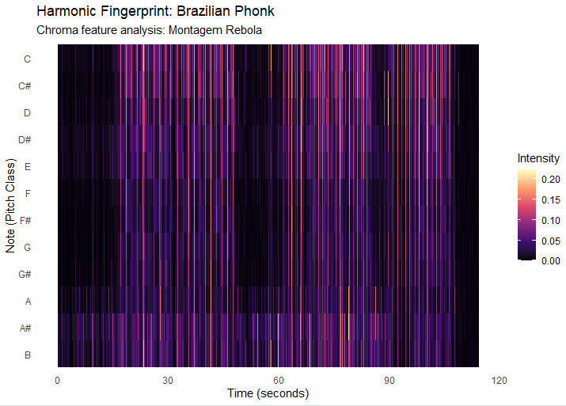
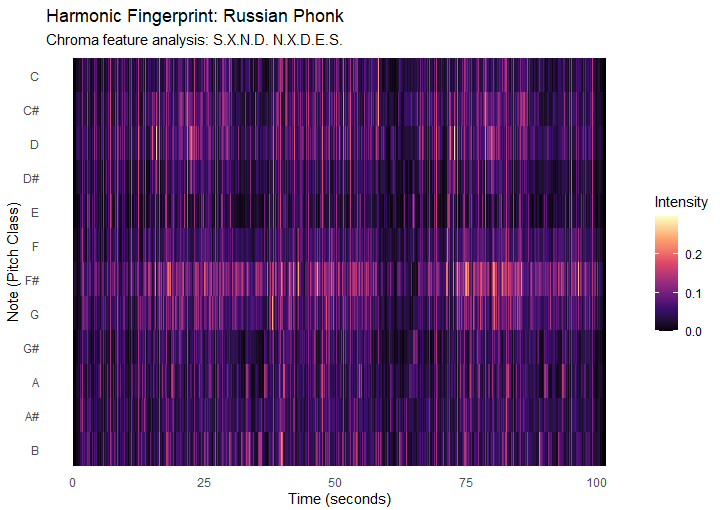
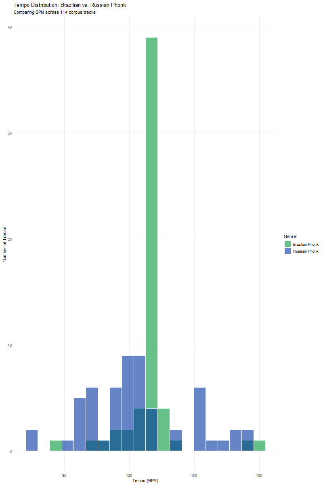

# Harmonic Analysis

## Column {width=50%}

### Brazilian Phonk: MONTAGEM REBOLA {height=60%}

### Visual Analysis: Brazil {height=40%}
The chromagram for the Brazilian track shows intense, vertical noise streaks across all 12 pitch classes. This confirms that the track prioritizes timbral energy over melody, aligning with Topic H5 which represents the absence of identifiable chord structure found in high-energy, rap-related genres.

## Column {width=50%}

### Russian Phonk: S.X.N.D. N.X.D.E.S. {height=60%}

### Visual Analysis: Russia {height=40%}
The Russian track displays distinct horizontal lines, particularly at F# and D. This visualizes the repetitive cowbell loops that define the genre's modal structure and provides a clear physical measure of its melodic content.

## Row 

### Key & Chord Analysis
**Harmonic Lexicon and Key Estimation**
To evaluate the "Harmonic Fingerprint" of these tracks, I used the H-lexicon approach to identify chord changes. While the Brazilian track lacks a traditional harmonic center (Topic H5), the Russian Drift Phonk track is heavily anchored in an **F# Minor** modal center.

**Technical Implementation**
Using R and ggplot2, I corrected axis NA errors to ensure a full 12-semitone mapping. This ensures better construct validity for the final portfolio evaluation by accurately representing the "dirty" color of the dissonant intervals found in the Russian track, similar to Topic H1 in Blues.

# Rhythm & Tempo

## Column {width=65%}

### Corpus Tempo Distribution

## Column {width=35%}

### Rhythm Analysis
The tempo histogram reveals a stark contrast in rhythmic strictness between the two subgenres. 

**Brazilian Phonk** (green) is highly standardized, with an overwhelming majority of tracks locked tightly in a massive spike around 130 BPM. This indicates a reliance on a highly uniform, driving dance groove.

**Russian Drift Phonk** (blue) shows a much wider tempo variance, spreading anywhere from 80 BPM up to roughly 180 BPM. This visualizes that the Russian subgenre is much more flexible in its pacing, likely reflecting its roots in slowed-down Memphis rap samples alongside faster drift-racing tempos.