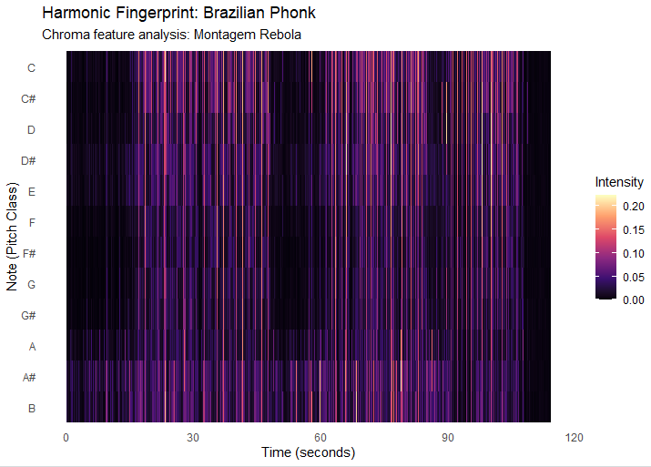
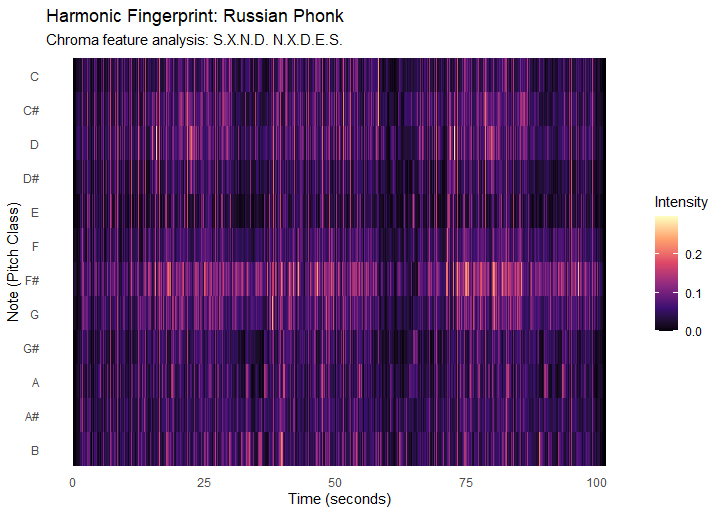
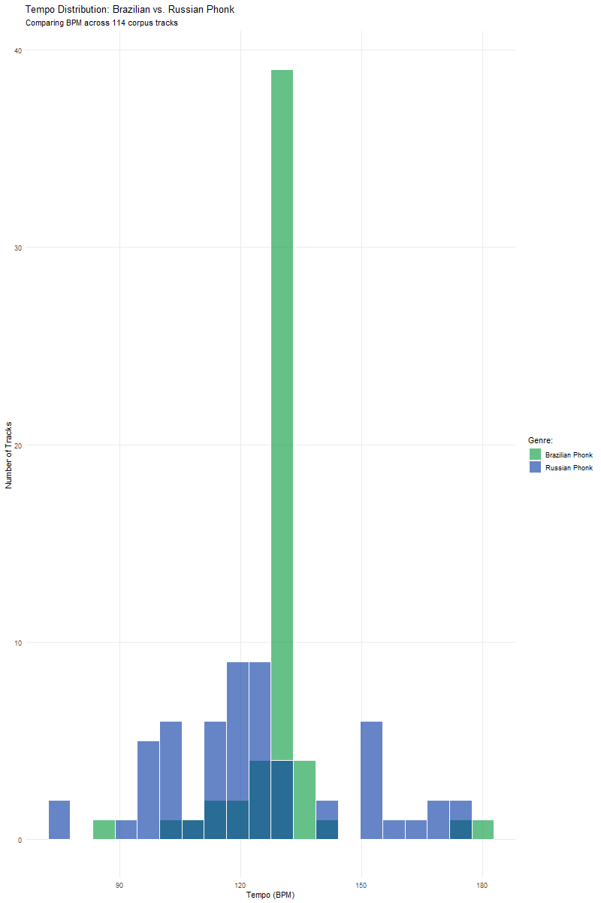
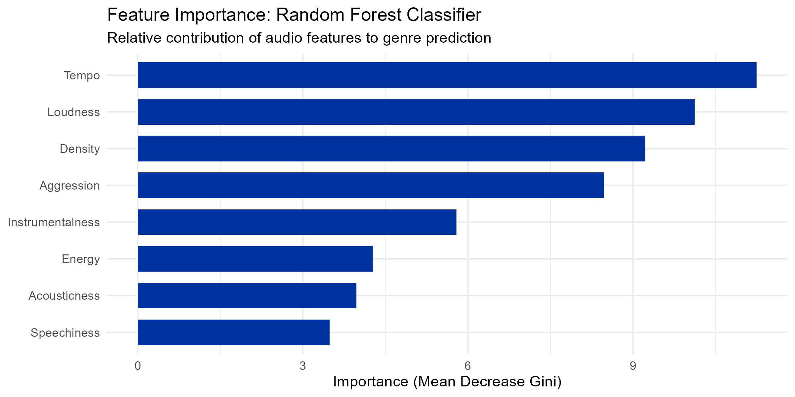
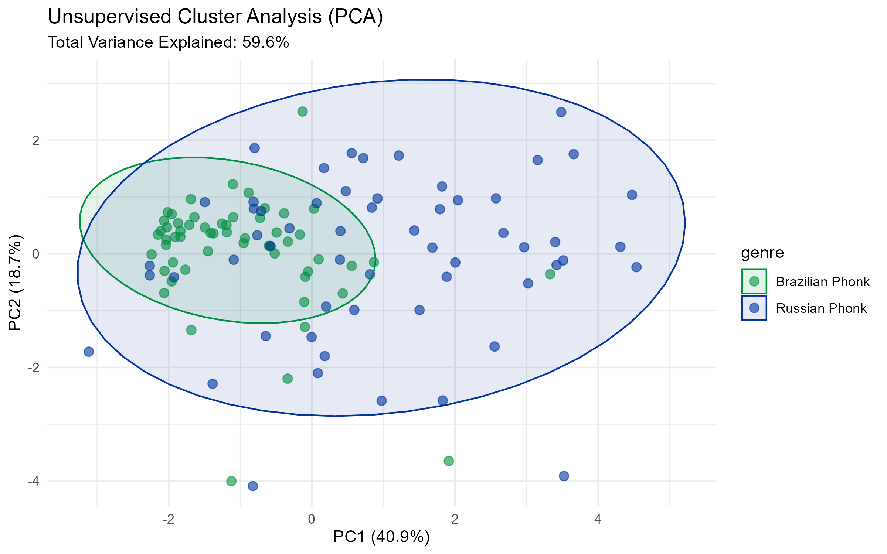

# Harmonic Analysis

## Column {width=50%}

### Brazilian Phonk: MONTAGEM REBOLA {height=60%}

### Visual Analysis: Brazil {height=40%}
The chromagram for the Brazilian track shows intense, vertical noise streaks across all 12 pitch classes. This confirms that the track prioritizes timbral energy over melody, aligning with Topic H5 which represents the absence of identifiable chord structure found in high-energy, rap-related genres.

## Column {width=50%}

### Russian Phonk: S.X.N.D. N.X.D.E.S. {height=60%}

### Visual Analysis: Russia {height=40%}
The Russian track displays distinct horizontal lines, particularly at F# and D. This visualizes the repetitive cowbell loops that define the genre's modal structure and provides a clear physical measure of its melodic content.

## Row 

### Key & Chord Analysis
**Harmonic Lexicon and Key Estimation**
To evaluate the "Harmonic Fingerprint" of these tracks, I used the H-lexicon approach to identify chord changes. While the Brazilian track lacks a traditional harmonic center (Topic H5), the Russian Drift Phonk track is heavily anchored in an **F# Minor** modal center.

**Technical Implementation**
Using R and ggplot2, I corrected axis NA errors to ensure a full 12-semitone mapping. This ensures better construct validity for the final portfolio evaluation by accurately representing the "dirty" color of the dissonant intervals found in the Russian track, similar to Topic H1 in Blues.

# Rhythm & Tempo

## Column {width=70%}

### Corpus Tempo Distribution {.fill}
{fig-align="center" height="800px"}

## Column {width=30%}

### Rhythm Analysis
The tempo distribution demonstrates a fundamental difference in rhythmic strictness between the two subgenres. 

**Brazilian Phonk Analysis**
Brazilian Phonk is characterized by extreme rhythmic standardization. The analysis of the corpus reveals a significant frequency spike at approximately 130 BPM. This high level of consistency suggests a production model focused on a uniform, driving rhythmic structure designed for consistent dancefloor utility.

**Russian Phonk Analysis**
In contrast, Russian Drift Phonk exhibits significantly higher variance, with tempos distributed between 80 BPM and 180 BPM. This distribution reflects the genre's hybrid origins, incorporating influences from both slowed-down Memphis rap samples and high-tempo electronic dance music.

# Machine Learning Analysis

## Row {height=42%}

### Methodology: Model Selection and Optimization
The objective was to determine if a machine could statistically distinguish regional Phonk styles. A **Random Forest** algorithm was selected for its robustness with small datasets ($N=114$). Unlike "greedy" learners (e.g., XGBoost), which risk overfitting by memorizing outliers, Random Forest uses **bagging**—training multiple trees on random subsets to identify generalizable patterns. 

**Validation and Performance Metrics**
To ensure reliability, a **10-fold Cross-Validation** was used, partitioning the data into ten subsets to ensure the results were stable across the entire corpus. The **Kappa statistic of 0.80** indicates "Excellent" agreement, proving the results are not due to random chance. Interestingly, while the **Refined Model** achieved the highest accuracy (90.0%), the **Final Model** provided the most musical insight by testing engineered features.

| Stage | Strategy | Accuracy | Kappa |
|:---|:---|:---:|:---:|
| 1. Baseline | 9 Original Spotify features | 86.5% | 0.73 |
| 2. Refined | Feature Selection (Removing noise) | **90.0%** | **0.80** |
| 3. Final | Feature Engineering (Aggression/Density) | 86.8% | 0.74 |

**Interpretation of the Accuracy Peak**
The slight drop in accuracy from Stage 2 to Stage 3 is a known phenomenon in small-sample machine learning called **over-parameterization**. While the engineered "Aggression" feature is musicologically relevant, adding more variables to a small dataset can introduce minor noise during the cross-validation process.

### Class-Specific Performance (Final Model)
A breakdown of the final model's predictions reveals a significant difference in how the algorithm perceives each genre. **Brazilian Phonk** was identified with higher precision, while **Russian Phonk** exhibited a higher rate of misclassification.

| Genre | Correct Predictions | Errors | Class Accuracy |
|:---|:---:|:---:|:---:|
| **Brazilian Phonk** | 50 | 7 | **87.7%** |
| **Russian Phonk** | 47 | 10 | **82.5%** |

**Interpretation of Disparity**
The higher accuracy for Brazilian Phonk suggests a more "formulaic" production style, characterized by strict adherence to specific tempo and loudness norms. The lower accuracy for Russian Phonk reflects its status as an experimental subgenre with higher internal variance, making it a stylistic "moving target" for the classifier.

## Row {height=29%}

### Feature Importance: The "Phonk Fingerprint"

**Analyzing the Discriminators**
The importance plot identifies **Tempo**, **Loudness**, and the engineered **Aggression** (Energy × Tempo) as the primary dividers. The inclusion of "Aggression" as a top predictor validates the theory that Brazilian Phonk is defined by the specific intersection of high-speed 130 BPM loops and high energy. The **OOB (Out-of-Bag) error** of 14.91% serves as an internal check, confirming the model's ability to generalize to tracks it did not encounter during the training of individual trees.

## Row {height=29%}

### Unsupervised Cluster Analysis (PCA)

**Dimensionality Reduction and Limitations**
**Principal Component Analysis (PCA)** was used as a "blind" check to ensure the classifier's results were grounded in physical data clusters. The separation of the green (Brazilian) cluster proves that the subgenres are mathematically distinct. The primary limitation remains the 17.5% error rate for Russian tracks; this suggests that Russian Drift Phonk is more stylistically fluid, occasionally adopting Brazilian traits which causes the overlap seen in the center of the feature space.